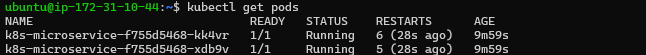
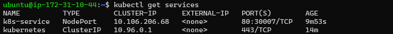
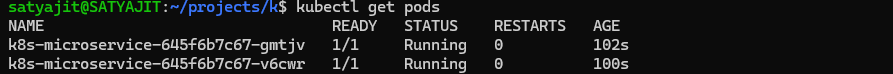
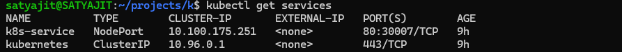

# 🚀 Kubernetes Microservice Deployment Project

## 📌 Project Overview

This project demonstrates the complete deployment lifecycle of a Python-based microservice using modern DevOps practices.  

The application is built with **FastAPI**, containerized using **Docker**, and deployed on **Kubernetes** (Minikube & AWS EC2).  

It showcases container orchestration, service exposure, scaling, and cluster management.

---

## 🛠️ Tech Stack

- Python (FastAPI)
- Uvicorn
- Docker
- DockerHub
- Kubernetes (Minikube)
- AWS EC2
- Git & GitHub

## 🏗️ Architecture Flow

1. Developed REST API using FastAPI
2. Containerized the application using Docker
3. Pushed Docker image to DockerHub
4. Provisioned AWS EC2 instance
5. Installed Docker & Kubernetes tools on EC2
6. Initialized Kubernetes cluster using kubeadm
7. Deployed application using Kubernetes Deployment
8. Exposed service using NodePort
9. Accessed application via EC2 Public IP
10. Also tested locally using Minikube

## 📂 Project Structure

```
k8s-microservice/
│
├── app/
│   └── main.py                # FastAPI application
│
├── k8s/
│   ├── deployment.yaml        # Kubernetes Deployment configuration
│   └── service.yaml           # Kubernetes Service (NodePort)
│
├── screenshots/
│   ├── ec2-pods.png            # EC2 Kubernetes pods running
│   ├── ec2-service.png         # EC2 NodePort service
│   ├── ec2-api.png             # EC2 application output in browser
│   ├── local-pods.png          # Local Minikube pods
│   ├── local-service.png       # Local Minikube service
│   └── local-api.png           # Local Swagger/API docs
│
├── Dockerfile                 # Docker image definition
├── requirements.txt           # Python dependencies
└── README.md                  # Project documentation
```
```
## 🏛️ Deployment Architecture

Client (Browser)
        ↓
EC2 Public IP : NodePort
        ↓
Kubernetes Service
        ↓
Kubernetes Pod
        ↓
Docker Container
        ↓
FastAPI Application
```

## ☁️ Cloud Infrastructure

- AWS EC2 (t3.small)
- Ubuntu Server
- Docker Engine
- Kubernetes (kubeadm cluster)
- NodePort Service for external access


----

## 🚀 How to Run Locally

### 1️⃣ Start Minikube

minikube start

### 2️⃣ Apply Deployment

kubectl apply -f k8s/deployment.yaml

kubectl apply -f k8s/service.yaml

### 2️⃣ Access service 

minikube service k8s-service 

---

## 📊 Kubernetes Concepts Used

- Pods
- Deployments
- ReplicaSets
- NodePort Service
- Scaling
- Rollout Restart
- Logs & Debugging

---

## 🔍 API Endpoints

- `/` → Returns a status page indicating that the K8s Microservice is running successfully.
---

## 📸 Deployment Proof

### ☁️ AWS EC2 Deployment

#### Pods Running on EC2


#### NodePort Service (EC2)


#### API Documentation (EC2)


---

### 💻 Local Deployment (Minikube)

#### Pods Running Locally


#### Service via Minikube Tunnel


#### API Documentation (Local)

---

## 🎯 Learning Outcomes

Through this project, I gained hands-on experience in:

- Building REST APIs using FastAPI
- Containerizing applications using Docker
- Creating optimized Docker images
- Pushing images to DockerHub
- Setting up and managing a Kubernetes cluster
- Writing Deployment and Service YAML manifests
- Exposing applications using NodePort
- Debugging pods and analyzing logs
- Scaling deployments using replicas
- Provisioning and managing AWS EC2 instances
- Installing Docker and Kubernetes on cloud infrastructure
- Deploying applications on a live cloud server
- Understanding networking between EC2, Kubernetes, and services
- Implementing an end-to-end DevOps workflow from development to cloud deployment
---

## 👨‍💻 Author

Satyajit Sonkar  
B.Sc Cloud Computing  
DevOps & Kubernetes Enthusiast 🚀

---

⭐ This project demonstrates practical implementation of container orchestration using Kubernetes.
